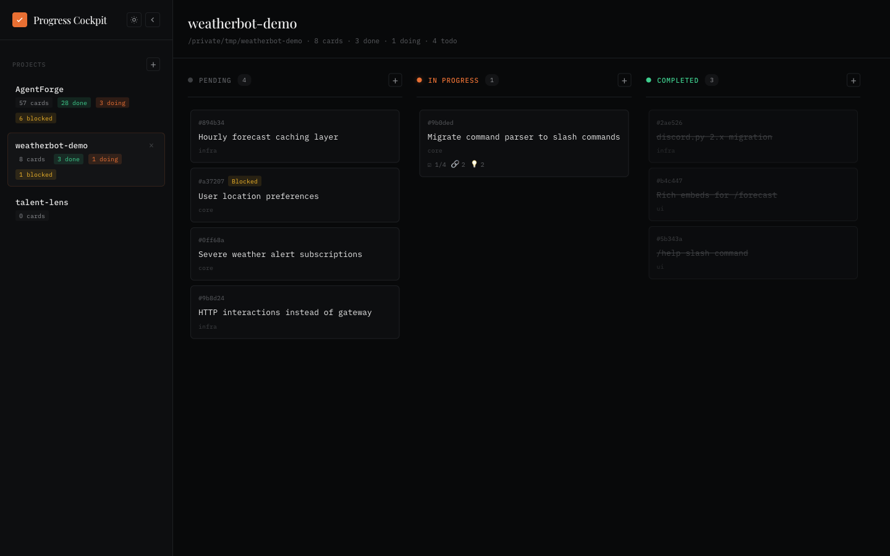
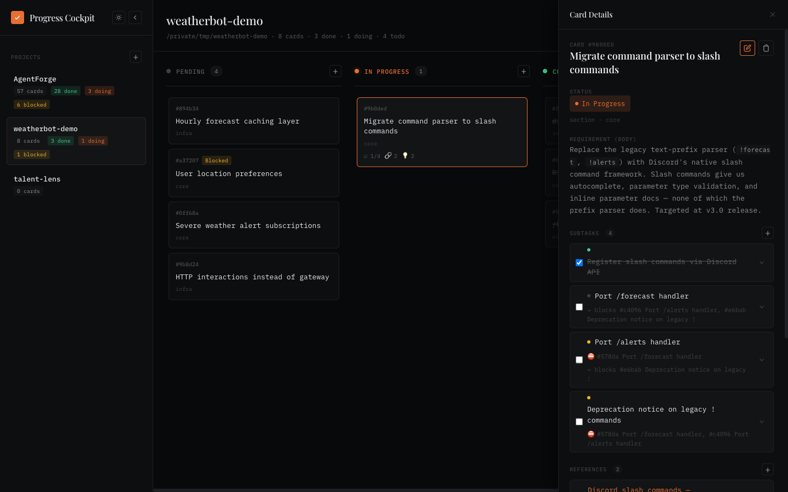
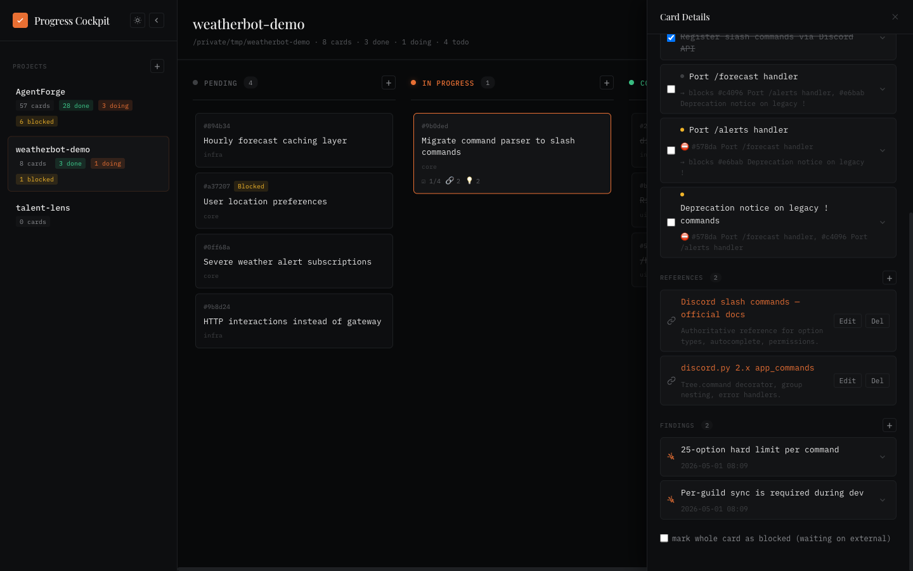

# Progress Cockpit

English · [中文](./README.zh-CN.md)

A local, requirement-level project board for code repositories. Each card captures a feature/requirement with subtasks, references, and accumulating research findings — all stored as plain JSON inside the repo it describes.

Pairs with the **`progress-tracker`** Claude skill (in [`skill/`](./skill/)) so AI assistants can register requirements, log research, and track decisions during normal conversation.



## Why

Most kanban tools either live outside the repo (Linear, Jira) or treat each card as a single-line todo. This tool keeps progress data **inside the repo** (`.claude-progress/`, git-tracked), and a card is a **requirement-shaped thing**:

- `body` — what the requirement is
- `subtasks[]` — actionable steps with intra-card dependencies
- `references[]` — external material to consult
- `findings[]` — research output that accumulates as you work (read X doc → conclusion Y; explored code → discovered Z)

The board renders the same data, the REST API edits it, and a Claude skill lets the AI maintain it without you having to context-switch.

## Stack

- **Backend**: Python 3.11+, FastAPI, Pydantic v2 — single small module set
- **Frontend**: React 18 + TypeScript + Vite + dnd-kit + react-query + react-markdown
- **Storage**: per-project `.claude-progress/state.json` (plain JSON in your repo)
- **Discovery**: explicit registry at `<install>/.config/projects.json` (auto-bootstrapped on first run from `$PROGRESS_PROJECTS_ROOT` or `~/workspace/projects`)

## Install & run

```bash
# 1. Backend
python3 -m venv .venv
.venv/bin/pip install -e .

# 2. Frontend (one-time build)
cd frontend
pnpm install
pnpm build
cd ..

# 3. Start
.venv/bin/python -m backend.main
# → http://127.0.0.1:3458
```

For frontend hot-reload during development:

```bash
# Terminal A — API
.venv/bin/python -m backend.main

# Terminal B — Vite dev server, /api proxied to :3458
cd frontend && pnpm dev
# → http://127.0.0.1:5173
```

### Configuration (env vars)

| Var | Default | Effect |
|---|---|---|
| `PORT` | `3458` | HTTP port |
| `PROGRESS_PROJECTS_ROOT` | `~/workspace/projects` | Used **only** on first-run bootstrap and `POST /api/projects/registry/scan`. After that, the registry file is the source of truth. |
| `CLAUDE_DIR` | `~/.claude` | Used by the alternate read-only `claude-tasks` source. |
| `PROGRESS_SOURCE` | `claude-progress` | Default data source. |

## Adding projects

Two ways:

1. **From the UI**: click the `+` next to `Projects` in the sidebar; provide an absolute path to a directory that already has `.claude-progress/`. (Initialize via the skill: `/progress-tracker init` in your repo.)
2. **From the API**:
   ```bash
   curl -X POST http://127.0.0.1:3458/api/projects/registry \
     -H 'Content-Type: application/json' \
     -d '{"path":"/abs/path/to/your/repo"}'
   ```

The registry lives at `<install>/.config/projects.json` and is gitignored — it's per-machine state.

## What's in a card

Click a card and the right panel opens with everything attached to that requirement:



The four buckets — `body` / `subtasks[]` / `references[]` / `findings[]` — are deliberately separate:

- **`body`** describes the requirement (what + why), written once
- **`subtasks[]`** are actionable steps with intra-card `blockedBy` dependencies; check them off as you go
- **`references[]`** are external material to consult (links, docs, design files)
- **`findings[]`** accumulate as you work — research results, code-exploration discoveries, decisions; they keep their timestamp so you can see how understanding evolved



### Card storage shape

```jsonc
{
  "project": "myrepo",
  "cards": [
    {
      "id": "c_a1b2c3d4e5",
      "status": "pending | in_progress | completed",
      "blocked": false,
      "title": "Wire auth middleware",
      "body": "What this requirement is — written once.",
      "section": "backend",
      "tags": [],
      "priority": null,
      "subtasks": [
        { "id": "s_...", "title": "...", "done": false, "body": "...", "blockedBy": ["s_..."] }
      ],
      "references": [
        { "id": "r_...", "title": "...", "url": "...", "note": "..." }
      ],
      "findings": [
        { "id": "f_...", "title": "one-line summary", "body": "research result" }
      ]
    }
  ]
}
```

## REST API

| Op | Endpoint |
|---|---|
| List projects | `GET /api/sessions` |
| Read full project state | `GET /api/projects/{repo}/state` |
| Create card | `POST /api/projects/{repo}/cards` |
| Patch card | `PUT /api/projects/{repo}/cards/{cid}` |
| Delete card | `DELETE /api/projects/{repo}/cards/{cid}` |
| Add subtask / reference / finding | `POST /api/projects/{repo}/cards/{cid}/{kind}` |
| Patch / delete nested | `PUT|DELETE /api/projects/{repo}/cards/{cid}/{kind}/{itemId}` |
| Registry: list / add / remove / scan | `GET / POST / DELETE /api/projects/registry[/{id}\|/scan]` |

`{kind}` ∈ `subtasks` / `references` / `findings`.

Full endpoint browser: `http://127.0.0.1:3458/api/docs` (FastAPI Swagger UI).

## The Claude skill

`skill/SKILL.md` is a Claude Agent skill that talks to this server (or falls back to direct file edits when the server isn't running).

To install for [Claude Code](https://claude.com/claude-code):

```bash
mkdir -p ~/.claude/skills/progress-tracker
cp skill/SKILL.md ~/.claude/skills/progress-tracker/
```

The skill exposes:

- `/progress-tracker load` — read state and report current status / recent log / long-term context
- `/progress-tracker update` — interactive update flow
- `/progress-tracker status` — quick state summary
- `/progress-tracker init` — initialize `.claude-progress/` in the current repo

It also triggers proactively on natural-language phrases (e.g., "log this requirement", "I read X and concluded Y", "explored code, found that ...").

## Acknowledgements

The kanban frontend was originally adapted from **[L1AD/claude-task-viewer](https://github.com/L1AD/claude-task-viewer)** — a web Kanban for `~/.claude/tasks/`. Progress Cockpit grew from there: pluggable data sources, a different storage model (requirement cards vs. task lists), full CRUD over a structured schema, drag-to-change-status, and a paired Claude skill. 

## License

MIT — see [LICENSE](./LICENSE).
