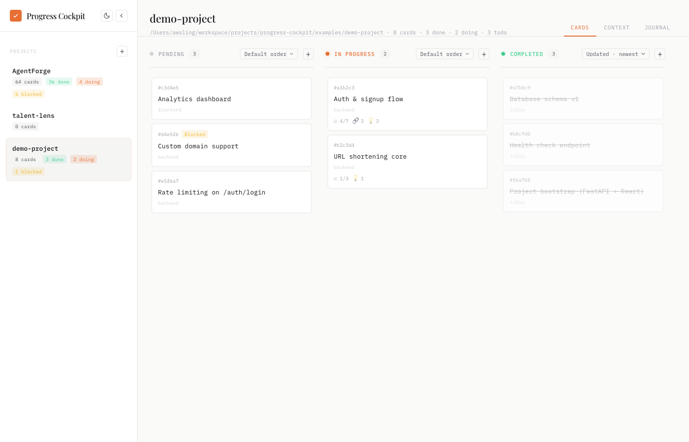
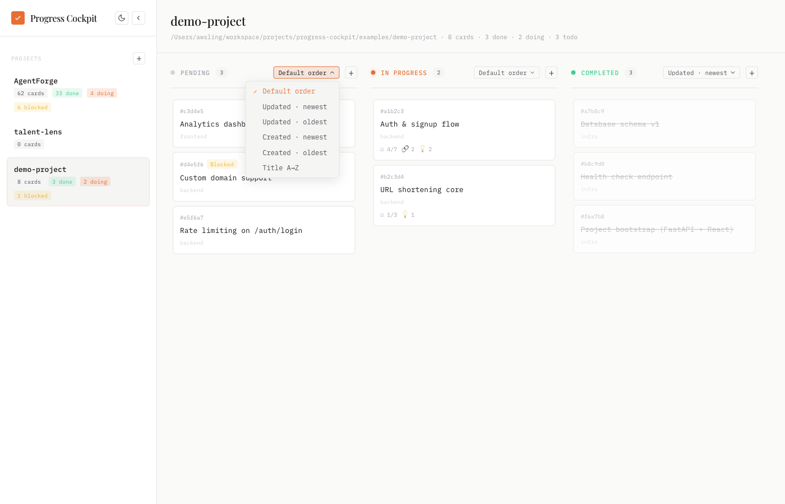
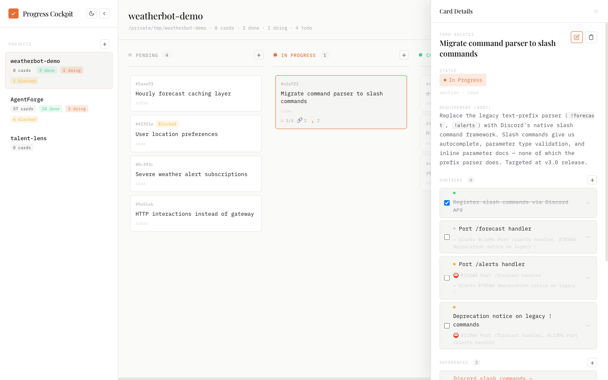
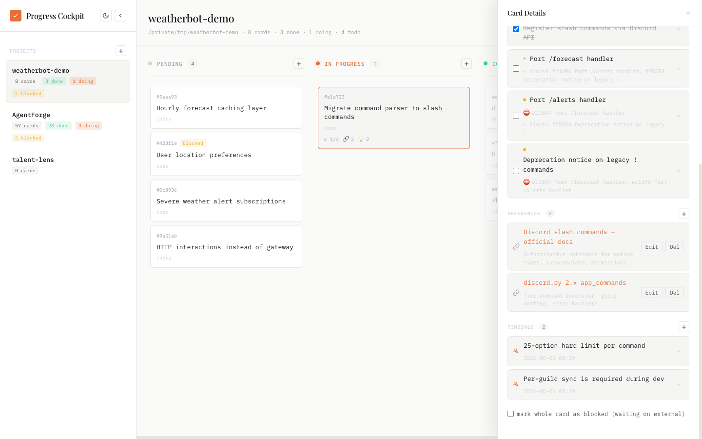
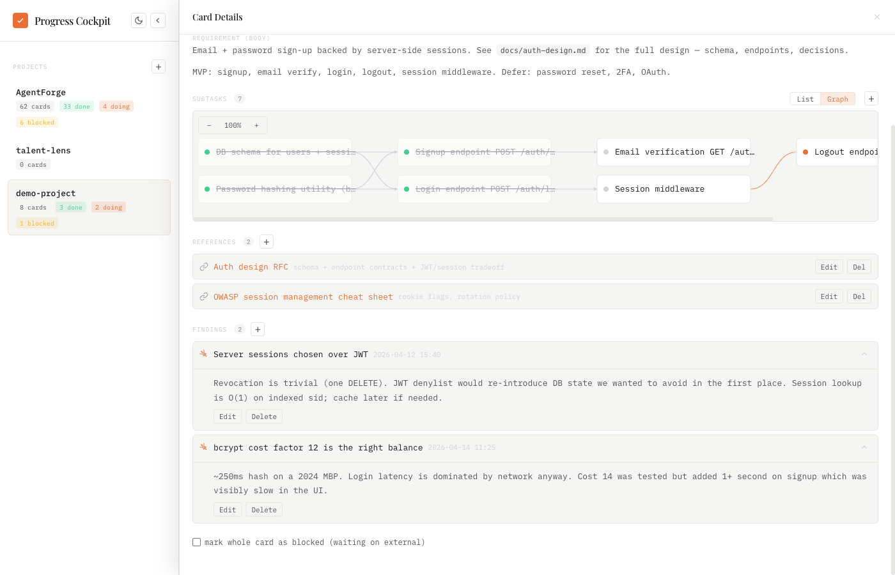
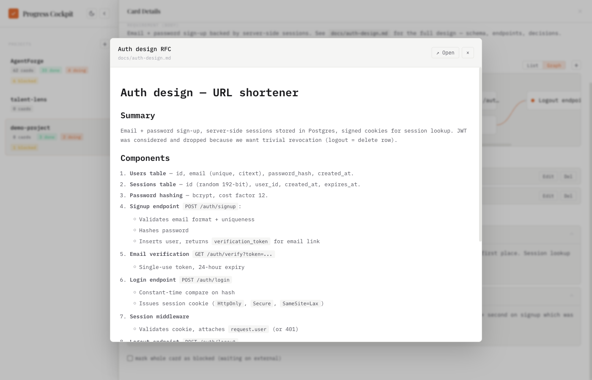
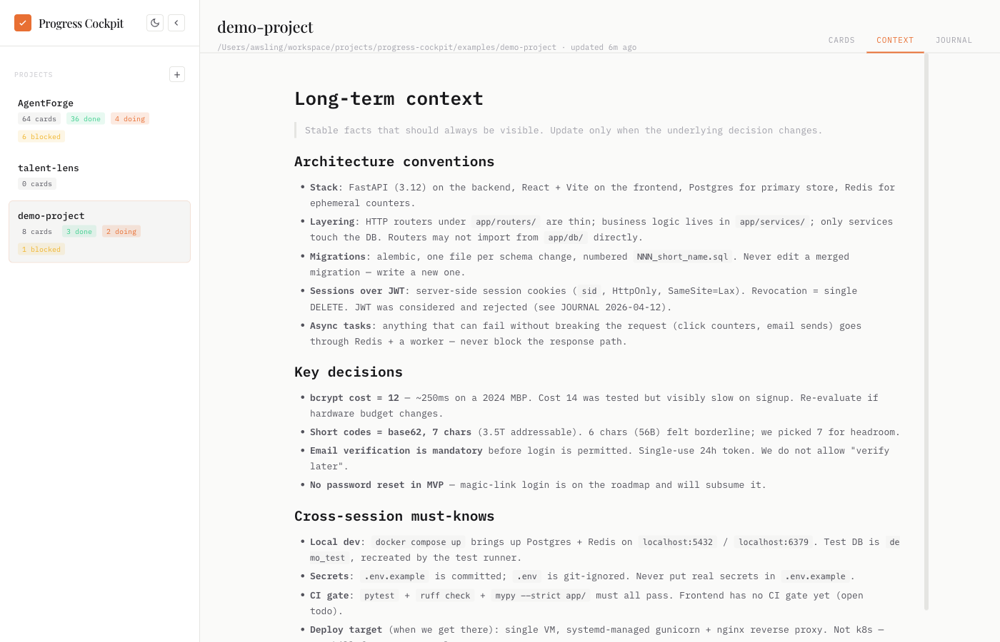
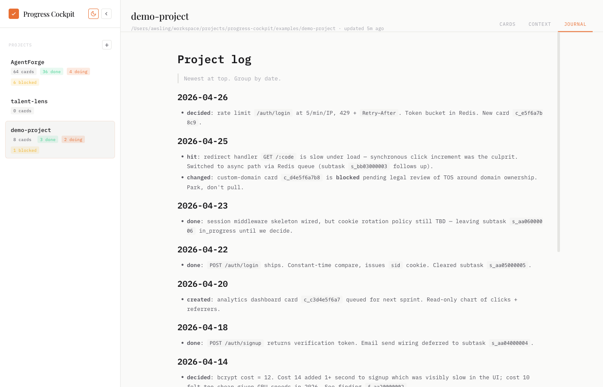

# Progress Cockpit

English · [中文](./README.zh-CN.md)

A local, requirement-level project board for code repositories. Each card captures a feature/requirement with subtasks, references, and accumulating research findings — all stored as plain JSON inside the repo it describes.

Pairs with the **`progress-tracker`** Claude skill (in [`skill/`](./skill/)) and an **MCP server** (in [`backend/mcp_server.py`](./backend/mcp_server.py)) so AI assistants can register requirements, log research, and track decisions during normal conversation.

<picture>
  <source media="(prefers-color-scheme: dark)" srcset="./docs/screenshot-board-dark.png">
  <source media="(prefers-color-scheme: light)" srcset="./docs/screenshot-board-light.png">
  
</picture>

## Why

Most kanban tools either live outside the repo (Linear, Jira) or treat each card as a single-line todo. This tool keeps progress data **inside the repo** (`.claude-progress/`, git-tracked), and a card is a **requirement-shaped thing**:

- `body` — what the requirement is
- `subtasks[]` — actionable steps with intra-card dependencies
- `references[]` — external material to consult
- `findings[]` — research output that accumulates as you work (read X doc → conclusion Y; explored code → discovered Z)

The board renders the same data, the REST API and an MCP server edit it, and a Claude skill lets the AI maintain it without you having to context-switch.

## Stack

- **Backend**: Python 3.11+, FastAPI, Pydantic v2, MCP SDK
- **Frontend**: React 18 + TypeScript + Vite + dnd-kit + react-query + react-markdown
- **Storage**: per-project `.claude-progress/state.json` (plain JSON in your repo)
- **Concurrency**: per-project `threading.Lock` + atomic write (`tmp + fsync + os.replace`) — safe under parallel API writes
- **Discovery**: explicit registry at `<install>/.config/projects.json` (auto-bootstrapped on first run from `$PROGRESS_PROJECTS_ROOT` or `~/workspace/projects`)

## Install & run

One-shot launcher:

```bash
./start.sh              # prod: backend on :3458 serves the built frontend
./start.sh --dev        # backend + Vite dev server on :5173 with HMR
./start.sh --rebuild    # force-rebuild the frontend bundle before starting
./start.sh --setup      # only create venv, install deps, build frontend; don't run
```

The script auto-creates `.venv`, installs Python deps via `pip install -e .`, installs frontend deps with `pnpm` (or `npm` fallback), and builds `frontend/dist/` if missing. After the first run, plain `./start.sh` is enough.

If you'd rather run things manually, see [the manual install path](#manual-install) at the bottom.

### Configuration (env vars)

| Var | Default | Effect |
|---|---|---|
| `PORT` | `3458` | HTTP port |
| `PROGRESS_PROJECTS_ROOT` | `~/workspace/projects` | Used **only** on first-run bootstrap and `POST /api/projects/registry/scan`. After that, the registry file is the source of truth. |
| `CLAUDE_DIR` | `~/.claude` | Used by the alternate read-only `claude-tasks` source. |
| `PROGRESS_SOURCE` | `claude-progress` | Default data source. |

## Run on login (macOS)

A LaunchAgent template is shipped under `scripts/`:

```bash
./scripts/launchd.sh install     # copy plist to ~/Library/LaunchAgents and load
./scripts/launchd.sh status      # show launchctl print output
./scripts/launchd.sh logs        # tail stdout + stderr
./scripts/launchd.sh restart     # kickstart after code changes
./scripts/launchd.sh uninstall
```

Logs land in `~/Library/Logs/progress-cockpit.{out,err}.log`. The plist sets `RunAtLoad=true` + `KeepAlive=true` + `ThrottleInterval=10` so the service starts at login and auto-restarts on crash without hot-looping.

## Adding projects

Two ways:

1. **From the UI**: click the `+` next to `Projects` in the sidebar; provide an absolute path to a directory that already has `.claude-progress/`. (Initialize via the skill: `/progress-tracker init` in your repo.)
2. **From the API**:
   ```bash
   curl -X POST http://127.0.0.1:3458/api/projects/registry \
     -H 'Content-Type: application/json' \
     -d '{"path":"/abs/path/to/your/repo"}'
   ```

The registry lives at `<install>/.config/projects.json` and is gitignored — it's per-machine state.

A populated example lives in [`examples/demo-project/`](./examples/demo-project) (URL-shortener: 8 cards, a 7-step DAG, a markdown reference) — register that path to see the screenshots below come to life.

## Sorting and column view

Each kanban column has its own sort dropdown (Default / Updated · newest · oldest / Created · newest · oldest / Title A→Z). The choice is per-column, persisted in `localStorage`. **Completed defaults to Updated · newest** so the most recently finished work is always at the top; the other two columns default to manual / insertion order.

<picture>
  <source media="(prefers-color-scheme: dark)" srcset="./docs/screenshot-sort-dark.png">
  <source media="(prefers-color-scheme: light)" srcset="./docs/screenshot-sort-light.png">
  
</picture>

## What's in a card

Click a card and the right panel opens with everything attached to that requirement:

<picture>
  <source media="(prefers-color-scheme: dark)" srcset="./docs/screenshot-detail-dark.png">
  <source media="(prefers-color-scheme: light)" srcset="./docs/screenshot-detail-light.png">
  
</picture>

The four buckets — `body` / `subtasks[]` / `references[]` / `findings[]` — are deliberately separate:

- **`body`** describes the requirement (what + why), written once
- **`subtasks[]`** are actionable steps with intra-card `blockedBy` dependencies; check them off as you go
- **`references[]`** are external material to consult (links, docs, design files)
- **`findings[]`** accumulate as you work — research results, code-exploration discoveries, decisions; they keep their timestamp so you can see how understanding evolved

<picture>
  <source media="(prefers-color-scheme: dark)" srcset="./docs/screenshot-findings-dark.png">
  <source media="(prefers-color-scheme: light)" srcset="./docs/screenshot-findings-light.png">
  
</picture>

### Subtask dependency graph

When subtasks have `blockedBy` edges, the Subtasks panel offers a **List ↔ Graph** toggle. The Graph view is a layered DAG: depth = column, edges drawn between dependent items, status colour-coded (green = done · grey = pending · orange = blocked-by-unfinished). Zoom in/out with the toolbar; click a node to edit. List view stays available with a left-margin indent showing depth without reordering.

<picture>
  <source media="(prefers-color-scheme: dark)" srcset="./docs/screenshot-graph-dark.png">
  <source media="(prefers-color-scheme: light)" srcset="./docs/screenshot-graph-light.png">
  
</picture>

### Reference preview

Click a reference whose URL is a relative path (e.g. `docs/rfc.md`, `assets/design.png`) and the file opens in a Mac-spacebar-style preview overlay. Markdown gets rendered, images render inline, other text shows as-is. Hit ESC or click the backdrop to close, or `↗ Open` to send it to a new tab. External `https://...` links keep their default new-tab behaviour.

<picture>
  <source media="(prefers-color-scheme: dark)" srcset="./docs/screenshot-preview-dark.png">
  <source media="(prefers-color-scheme: light)" srcset="./docs/screenshot-preview-light.png">
  
</picture>

### Context & Journal

Each project has two free-form markdown companions to the kanban — `.claude-progress/CONTEXT.md` (slow-moving long-term facts: stack, conventions, key decisions) and `.claude-progress/JOURNAL.md` (dated timeline, newest at top: what got done, what was decided, what got hit). Both surface as tabs in the project header and hot-reload over SSE when the file is touched. Tabs without a file show a small dot and the body offers the exact path to create.

<picture>
  <source media="(prefers-color-scheme: dark)" srcset="./docs/screenshot-context-dark.png">
  <source media="(prefers-color-scheme: light)" srcset="./docs/screenshot-context-light.png">
  
</picture>

<picture>
  <source media="(prefers-color-scheme: dark)" srcset="./docs/screenshot-journal-dark.png">
  <source media="(prefers-color-scheme: light)" srcset="./docs/screenshot-journal-light.png">
  
</picture>

### Card storage shape

```jsonc
{
  "project": "myrepo",
  "cards": [
    {
      "id": "c_a1b2c3d4e5",
      "status": "pending | in_progress | completed",
      "blocked": false,
      "title": "Wire auth middleware",
      "body": "What this requirement is — written once.",
      "section": "backend",
      "tags": [],
      "priority": null,
      "subtasks": [
        { "id": "s_...", "title": "...", "done": false, "body": "...", "blockedBy": ["s_..."] }
      ],
      "references": [
        { "id": "r_...", "title": "...", "url": "...", "note": "..." }
      ],
      "findings": [
        { "id": "f_...", "title": "one-line summary", "body": "research result" }
      ]
    }
  ]
}
```

## REST API

| Op | Endpoint |
|---|---|
| List projects | `GET /api/sessions` |
| Read full project state | `GET /api/projects/{repo}/state` |
| Create card | `POST /api/projects/{repo}/cards` |
| Patch card | `PUT /api/projects/{repo}/cards/{cid}` |
| Delete card | `DELETE /api/projects/{repo}/cards/{cid}` |
| Add subtask / reference / finding | `POST /api/projects/{repo}/cards/{cid}/{kind}` |
| Patch / delete nested | `PUT \| DELETE /api/projects/{repo}/cards/{cid}/{kind}/{itemId}` |
| Project-local file (for relative reference URLs) | `GET /api/projects/{repo}/file?path=<rel>` |
| Registry: list / add / remove / scan | `GET / POST / DELETE /api/projects/registry[/{id}\|/scan]` |

`{kind}` ∈ `subtasks` / `references` / `findings`. `/file` is path-traversal hardened (`..`, absolute paths, and symlinks escaping the project root all 4xx).

Full endpoint browser: `http://127.0.0.1:3458/api/docs` (FastAPI Swagger UI).

## MCP server

`backend/mcp_server.py` exposes the data layer as a stdio MCP server (`progress-cockpit-mcp`) that talks to the local FastAPI process. Agents that speak MCP get typed tools instead of having to construct `curl` calls.

Install in [Claude Code](https://claude.com/claude-code):

```bash
claude mcp add progress-cockpit \
  /abs/path/to/progress-cockpit/.venv/bin/progress-cockpit-mcp \
  --env PROGRESS_COCKPIT_URL=http://127.0.0.1:3458
```

…or edit `~/.claude.json`:

```json
{
  "mcpServers": {
    "progress-cockpit": {
      "command": "/abs/path/to/progress-cockpit/.venv/bin/progress-cockpit-mcp",
      "env": { "PROGRESS_COCKPIT_URL": "http://127.0.0.1:3458" }
    }
  }
}
```

Tools (18 total):

| Group | Tools |
|---|---|
| Discovery | `list_projects` · `resolve_project_for_path` · `register_project` |
| Read | `list_cards` (compact index, optional `status` filter) · `get_card` (single card full detail) · `get_state` (full state — large; rarely the right tool) |
| Card | `create_card` / `update_card` / `delete_card` |
| Subtask | `create_subtask` / `update_subtask` / `delete_subtask` |
| Reference | `create_reference` / `update_reference` / `delete_reference` |
| Finding | `create_finding` / `update_finding` / `delete_finding` |

**Read pattern**: prefer `list_cards` first to get an index, then `get_card` to drill into one card. `get_state` returns *every* card with all bodies and nested arrays — for mature projects it can blow past MCP tool-result token limits.

## The Claude skill

`skill/SKILL.md` is a Claude Agent skill. It uses a three-tier write strategy:

1. **MCP tools** if the `progress-cockpit` MCP server is connected (preferred — typed args, no JSON construction)
2. **REST API** otherwise (any agent that has a shell)
3. **Direct file edit** of `state.json` if neither is reachable (last resort)

Install for Claude Code:

```bash
mkdir -p ~/.claude/skills/progress-tracker
cp skill/SKILL.md ~/.claude/skills/progress-tracker/
```

Subcommands:

- `/progress-tracker load` — read state, report current status / recent log / long-term context
- `/progress-tracker update` — interactive update flow
- `/progress-tracker status` — quick state summary
- `/progress-tracker init` — initialize `.claude-progress/` in the current repo

It also triggers proactively on natural-language phrases (e.g., "log this requirement", "I read X and concluded Y", "explored code, found that ...").

## Manual install

If you'd rather not use `start.sh`:

```bash
# 1. Backend
python3 -m venv .venv
.venv/bin/pip install -e .

# 2. Frontend (one-time build)
cd frontend
pnpm install
pnpm build
cd ..

# 3. Run
.venv/bin/python -m backend.main
# → http://127.0.0.1:3458
```

For frontend hot-reload during development, run the backend in one terminal and `cd frontend && pnpm dev` in another (Vite proxies `/api` to `:3458`).

## Acknowledgements

The kanban frontend was originally adapted from **[L1AD/claude-task-viewer](https://github.com/L1AD/claude-task-viewer)** — a web Kanban for `~/.claude/tasks/`. Progress Cockpit grew from there: pluggable data sources, a different storage model (requirement cards vs. task lists), full CRUD over a structured schema, drag-to-change-status, subtask DAG view, and a paired Claude skill / MCP server.

## License

MIT — see [LICENSE](./LICENSE).
